# Исследование заведений рынка общественного питания Москвы

## Цели и задачи проекта
**Цель:** Провести исследовательский анализ данных заведений общественного питания в Москве.

**Задачи:**
1. Загрузить данные и познакомиться с их содержимым.
2. Провести предобработку данных.
3. Провести исследовательский анализ данных:
    - изучить категории заведений;
    - изучить заведения в разрезе админитративных районов гор. Москва;
    - изучить сетевые и несетевые заведения;
    - проанализировать количество посадочных мест в заведениях;
    - исследовать рейтинг заведений;
    - изучить взаимосвязь рейтинга заведения с другими данными;
    - определить ТОП-15 популярных сетей;
    - изучить вариации среднего чека.
4. Сформулировать выводы по проведённому анализу.


## Данные

Для анализа поступили данные о заведениях общественного питания в Москве. Данные состоят из двух датасетов:

- `rest_info.csv` — информация о заведениях общественного питания;
- `rest_price.csv` —  информация о среднем чеке в заведениях общественного питания.

### Описание датасета `rest_info.csv`
- name — название заведения;
- address — адрес заведения;
- district — административный район, в котором находится заведение, например Центральный административный округ;
- category — категория заведения, например «кафе», «пиццерия» или «кофейня»;
- hours — информация о днях и часах работы;
- rating — рейтинг заведения по оценкам пользователей в Яндекс Картах (высшая оценка — 5.0);
- chain — число, выраженное 0 или 1, которое показывает, является ли заведение сетевым (для маленьких сетей могут встречаться ошибки):
    - 0 — заведение не является сетевым;
    - 1 — заведение является сетевым.
- seats — количество посадочных мест.


### Описание датасета `rest_price.csv`
- price — категория цен в заведении, например «средние», «ниже среднего», «выше среднего» и так далее;
- avg_bill — строка, которая хранит среднюю стоимость заказа в виде диапазона, например:
    - «Средний счёт: 1000–1500 ₽»;
    - «Цена чашки капучино: 130–220 ₽»;
    - «Цена бокала пива: 400–600 ₽».
    - и так далее;
- middle_avg_bill — число с оценкой среднего чека, которое указано только для значений из столбца avg_bill, начинающихся с подстроки «Средний счёт»:
    - Если в строке указан ценовой диапазон из двух значений, в столбец войдёт медиана этих двух значений.
    - Если в строке указано одно число — цена без диапазона, то в столбец войдёт это число.
    - Если значения нет или оно не начинается с подстроки «Средний счёт», то в столбец ничего не войдёт.
- middle_coffee_cup — число с оценкой одной чашки капучино, которое указано только для значений из столбца avg_bill, начинающихся с подстроки «Цена одной чашки капучино»:
    - Если в строке указан ценовой диапазон из двух значений, в столбец войдёт медиана этих двух значений.
    - Если в строке указано одно число — цена без диапазона, то в столбец войдёт это число.
    - Если значения нет или оно не начинается с подстроки «Цена одной чашки капучино», то в столбец ничего не войдёт.


## Структура проекта

1. Цели и задачи проекта.
2. Данные.
3. Структура.
4. Загрузка данных.
5. Проверка данных.
6. Предобработка данных.
7. Поиск дубликатов.
8. Исследовательский анализ данных.
9. Выводы.

```text
public_caterind_msk/
├── .gitignore
├── README.md
├── data/
    ├── rest_info.csv
    └── rest_price.csv
├── notebooks/
    └── public_catering_msk.ipynb
└── images/
```

---

## Загрузка данных и знакомство с ними

Загрузим необходимые библиотеки для анализа данных и данные из датасетов `/datasets/rest_info.csv` и `/datasets/rest_price.csv`. Затем выведем основную информацию о данных с помощью метода `info()` и первые строки датафрейма.


```python
# Импортируем библиотеки
import pandas as pd

# Загружаем библиотеки для визуализации данных
import matplotlib.pyplot as plt
import seaborn as sns

# Загружаем библиотеку для расчёта коэффициента корреляции phi_k
from phik import phik_matrix
```


```python
# Выгружаем данные в переменные rest_info и clients_df
rest_info = pd.read_csv('https://code.s3.yandex.net/datasets/rest_info.csv')
rest_price = pd.read_csv('https://code.s3.yandex.net/datasets/rest_price.csv')
```

## Проверка ошибок в данных и их предобработка
### Названия столбцов и тип данных

Познакомимся с данными датасета `rest_info`


```python
# Выводим первые строки датафрейма на экран
rest_info.head()
```


<div>
<table border="1" class="dataframe">
  <thead>
    <tr style="text-align: right;">
      <th></th>
      <th>id</th>
      <th>name</th>
      <th>category</th>
      <th>address</th>
      <th>district</th>
      <th>hours</th>
      <th>rating</th>
      <th>chain</th>
      <th>seats</th>
    </tr>
  </thead>
  <tbody>
    <tr>
      <th>0</th>
      <td>0c3e3439a8c64ea5bf6ecd6ca6ae19f0</td>
      <td>WoWфли</td>
      <td>кафе</td>
      <td>Москва, улица Дыбенко, 7/1</td>
      <td>Северный административный округ</td>
      <td>ежедневно, 10:00–22:00</td>
      <td>5.0</td>
      <td>0</td>
      <td>NaN</td>
    </tr>
    <tr>
      <th>1</th>
      <td>045780ada3474c57a2112e505d74b633</td>
      <td>Четыре комнаты</td>
      <td>ресторан</td>
      <td>Москва, улица Дыбенко, 36, корп. 1</td>
      <td>Северный административный округ</td>
      <td>ежедневно, 10:00–22:00</td>
      <td>4.5</td>
      <td>0</td>
      <td>4.0</td>
    </tr>
    <tr>
      <th>2</th>
      <td>1070b6b59144425896c65889347fcff6</td>
      <td>Хазри</td>
      <td>кафе</td>
      <td>Москва, Клязьминская улица, 15</td>
      <td>Северный административный округ</td>
      <td>пн-чт 11:00–02:00; пт,сб 11:00–05:00; вс 11:00...</td>
      <td>4.6</td>
      <td>0</td>
      <td>45.0</td>
    </tr>
    <tr>
      <th>3</th>
      <td>03ac7cd772104f65b58b349dc59f03ee</td>
      <td>Dormouse Coffee Shop</td>
      <td>кофейня</td>
      <td>Москва, улица Маршала Федоренко, 12</td>
      <td>Северный административный округ</td>
      <td>ежедневно, 09:00–22:00</td>
      <td>5.0</td>
      <td>0</td>
      <td>NaN</td>
    </tr>
    <tr>
      <th>4</th>
      <td>a163aada139c4c7f87b0b1c0b466a50f</td>
      <td>Иль Марко</td>
      <td>пиццерия</td>
      <td>Москва, Правобережная улица, 1Б</td>
      <td>Северный административный округ</td>
      <td>ежедневно, 10:00–22:00</td>
      <td>5.0</td>
      <td>1</td>
      <td>148.0</td>
    </tr>
  </tbody>
</table>
</div>


```python
# Выводим информацию о датафрейме
rest_info.info()
```

    <class 'pandas.core.frame.DataFrame'>
    RangeIndex: 8406 entries, 0 to 8405
    Data columns (total 9 columns):
     #   Column    Non-Null Count  Dtype  
    ---  ------    --------------  -----  
     0   id        8406 non-null   object 
     1   name      8406 non-null   object 
     2   category  8406 non-null   object 
     3   address   8406 non-null   object 
     4   district  8406 non-null   object 
     5   hours     7870 non-null   object 
     6   rating    8406 non-null   float64
     7   chain     8406 non-null   int64  
     8   seats     4795 non-null   float64
    dtypes: float64(2), int64(1), object(6)
    memory usage: 591.2+ KB


```python
# Выводим номинальное и процентное количество пропусков
print(rest_info.isna().sum())
print(round(rest_info.isna().sum()/rest_info.shape[0]*100,1))
```

    id             0
    name           0
    category       0
    address        0
    district       0
    hours        536
    rating         0
    chain          0
    seats       3611
    dtype: int64
    id           0.0
    name         0.0
    category     0.0
    address      0.0
    district     0.0
    hours        6.4
    rating       0.0
    chain        0.0
    seats       43.0
    dtype: float64


Датасет `rest_info` содержит 8406 строк и 9 столбцов.
- Названия столбцов написаны корректно
- 6 столбцов имеют тип данных object: id, name, category, address, district, hours. Тип данных выбран корректно
- 2 столба имеют вещественный тип float64: rating и seats. Столбец seats показывает количество посадочных мест и не может быть дробным числом, соответственно можно перевести его в integer
- 1 столбец имеет целочисленный тип данных chain, который по сути является бинарным и должен содержать себе только 0 или 1.
- Столбец hours содержит 536 пропусков (6.4%)
- Столбец seats содержит 3611 пропусков (43.0%). Большая доля пропусков в этом столбце может помешать точным расчетам и анализу.

Познакомимся с данными датасета `rest_price`


```python
# Выводим первые строки датафрейма на экран
rest_price.head()
```


<div>
<table border="1" class="dataframe">
  <thead>
    <tr style="text-align: right;">
      <th></th>
      <th>id</th>
      <th>price</th>
      <th>avg_bill</th>
      <th>middle_avg_bill</th>
      <th>middle_coffee_cup</th>
    </tr>
  </thead>
  <tbody>
    <tr>
      <th>0</th>
      <td>045780ada3474c57a2112e505d74b633</td>
      <td>выше среднего</td>
      <td>Средний счёт:1500–1600 ₽</td>
      <td>1550.0</td>
      <td>NaN</td>
    </tr>
    <tr>
      <th>1</th>
      <td>1070b6b59144425896c65889347fcff6</td>
      <td>средние</td>
      <td>Средний счёт:от 1000 ₽</td>
      <td>1000.0</td>
      <td>NaN</td>
    </tr>
    <tr>
      <th>2</th>
      <td>03ac7cd772104f65b58b349dc59f03ee</td>
      <td>NaN</td>
      <td>Цена чашки капучино:155–185 ₽</td>
      <td>NaN</td>
      <td>170.0</td>
    </tr>
    <tr>
      <th>3</th>
      <td>a163aada139c4c7f87b0b1c0b466a50f</td>
      <td>средние</td>
      <td>Средний счёт:400–600 ₽</td>
      <td>500.0</td>
      <td>NaN</td>
    </tr>
    <tr>
      <th>4</th>
      <td>8a343546b24e4a499ad96eb7d0797a8a</td>
      <td>средние</td>
      <td>NaN</td>
      <td>NaN</td>
      <td>NaN</td>
    </tr>
  </tbody>
</table>
</div>


```python
# Выводим информацию о датафрейме
rest_price.info()
```

    <class 'pandas.core.frame.DataFrame'>
    RangeIndex: 4058 entries, 0 to 4057
    Data columns (total 5 columns):
     #   Column             Non-Null Count  Dtype  
    ---  ------             --------------  -----  
     0   id                 4058 non-null   object 
     1   price              3315 non-null   object 
     2   avg_bill           3816 non-null   object 
     3   middle_avg_bill    3149 non-null   float64
     4   middle_coffee_cup  535 non-null    float64
    dtypes: float64(2), object(3)
    memory usage: 158.6+ KB


```python
# Выводим номинальное и процентное количество пропусков
print(rest_price.isna().sum())
print(round(rest_price.isna().sum()/rest_info.shape[0]*100,1))
```

    id                      0
    price                 743
    avg_bill              242
    middle_avg_bill       909
    middle_coffee_cup    3523
    dtype: int64
    id                    0.0
    price                 8.8
    avg_bill              2.9
    middle_avg_bill      10.8
    middle_coffee_cup    41.9
    dtype: float64


Датасет `rest_price` содержит 4058 строк и 5 столбцов.
- Названия столбцов написаны корректно
- 3 столбца имеют тип данных object: id, price, avg_bill. Тип выбран верно
- 2 столбца имеют тип данных float64. Можно предположить, что средний чек заведения никогда не будет указан с точностью до десятичных долей и поэтому типы данных этих столбцов могли быть integer. Но мы не знает этого наверняка, поэтому не будем изменять тип данных.
- Столбец price имеет 743 пропуска (8.8%)
- Столбец avg_bill имеет 242 пропуска (2.9%)
- Столбец middle_avg_bill имеет 909 пропусков (10.8%). В описании было сказано, что пропуски в данном столбце возможны при отсутствии необходимых данных в столбце avg_bill.
- Столбец middle_coffee_cup имеет 3523 пропуска (41.9%). В описании было сказано, что пропуски в данном столбце возможны при отсутствии необходимых данных в столбце avg_bill.

---

### Промежуточный вывод

Датасет `rest_info` содержит 8406 строк `rest_price` содержит 4058 строк, соответственно, при объединении датасетов вместе, как минимум 4348 (51%) заведений останутся без информации о ценовых категориях. Удалять такое большое количество информации нельзя, поэтому просто объединим датасеты, сохранив количество строк `rest_info` по столбу `id`. К тому же, для решения почти всех аналитических задач в данном проекте, достаточно информации из датасета `rest_info`.

### Подготовка единого датафрейма


```python
# Объединим данные двух датасетов в один, с которым продолжим работу.
df=rest_info.merge(rest_price, how='left', on='id')
```


```python
df.head()
```


<div>
<table border="1" class="dataframe">
  <thead>
    <tr style="text-align: right;">
      <th></th>
      <th>id</th>
      <th>name</th>
      <th>category</th>
      <th>address</th>
      <th>district</th>
      <th>hours</th>
      <th>rating</th>
      <th>chain</th>
      <th>seats</th>
      <th>price</th>
      <th>avg_bill</th>
      <th>middle_avg_bill</th>
      <th>middle_coffee_cup</th>
    </tr>
  </thead>
  <tbody>
    <tr>
      <th>0</th>
      <td>0c3e3439a8c64ea5bf6ecd6ca6ae19f0</td>
      <td>WoWфли</td>
      <td>кафе</td>
      <td>Москва, улица Дыбенко, 7/1</td>
      <td>Северный административный округ</td>
      <td>ежедневно, 10:00–22:00</td>
      <td>5.0</td>
      <td>0</td>
      <td>NaN</td>
      <td>NaN</td>
      <td>NaN</td>
      <td>NaN</td>
      <td>NaN</td>
    </tr>
    <tr>
      <th>1</th>
      <td>045780ada3474c57a2112e505d74b633</td>
      <td>Четыре комнаты</td>
      <td>ресторан</td>
      <td>Москва, улица Дыбенко, 36, корп. 1</td>
      <td>Северный административный округ</td>
      <td>ежедневно, 10:00–22:00</td>
      <td>4.5</td>
      <td>0</td>
      <td>4.0</td>
      <td>выше среднего</td>
      <td>Средний счёт:1500–1600 ₽</td>
      <td>1550.0</td>
      <td>NaN</td>
    </tr>
    <tr>
      <th>2</th>
      <td>1070b6b59144425896c65889347fcff6</td>
      <td>Хазри</td>
      <td>кафе</td>
      <td>Москва, Клязьминская улица, 15</td>
      <td>Северный административный округ</td>
      <td>пн-чт 11:00–02:00; пт,сб 11:00–05:00; вс 11:00...</td>
      <td>4.6</td>
      <td>0</td>
      <td>45.0</td>
      <td>средние</td>
      <td>Средний счёт:от 1000 ₽</td>
      <td>1000.0</td>
      <td>NaN</td>
    </tr>
    <tr>
      <th>3</th>
      <td>03ac7cd772104f65b58b349dc59f03ee</td>
      <td>Dormouse Coffee Shop</td>
      <td>кофейня</td>
      <td>Москва, улица Маршала Федоренко, 12</td>
      <td>Северный административный округ</td>
      <td>ежедневно, 09:00–22:00</td>
      <td>5.0</td>
      <td>0</td>
      <td>NaN</td>
      <td>NaN</td>
      <td>Цена чашки капучино:155–185 ₽</td>
      <td>NaN</td>
      <td>170.0</td>
    </tr>
    <tr>
      <th>4</th>
      <td>a163aada139c4c7f87b0b1c0b466a50f</td>
      <td>Иль Марко</td>
      <td>пиццерия</td>
      <td>Москва, Правобережная улица, 1Б</td>
      <td>Северный административный округ</td>
      <td>ежедневно, 10:00–22:00</td>
      <td>5.0</td>
      <td>1</td>
      <td>148.0</td>
      <td>средние</td>
      <td>Средний счёт:400–600 ₽</td>
      <td>500.0</td>
      <td>NaN</td>
    </tr>
  </tbody>
</table>
</div>


## Предобработка данных

Выполним преобрзование типа данных столбца `seats` в integer, потому что число посадочных мест может быть только целочисленным.
Остальные типы данных в датасете выбраны корректно и не требуют корректировок.

## Явные и неявные дубликаты в данных
Проверим данные на наличие явных и неявных дубликатов. Для этого сначала нормализуем данные в текстовых столбцах.

## 3. Исследовательский анализ данных
Проведем исследовательский анализ исходных данных.

---

### Задача 1

Определим категории заведений представлены в данных. Исследуем количество объектов общественного питания по каждой категории. Результаты сопроводим подходящей визуализацией.


```python
# Выведем количество заведений по каждой категории
df['category'].value_counts()
```


    category
    кафе               2377
    ресторан           2041
    кофейня            1413
    бар,паб             765
    пиццерия            633
    быстрое питание     603
    столовая            315
    булочная            256
    Name: count, dtype: int64


```python
# Выведем процентное соотношение каждой категории к общему числу заведений
df['category'].value_counts()/df.shape[0]*100
```


    category
    кафе               28.287516
    ресторан           24.288944
    кофейня            16.815423
    бар,паб             9.103891
    пиццерия            7.533024
    быстрое питание     7.176009
    столовая            3.748661
    булочная            3.046531
    Name: count, dtype: float64


```python
# Визуализируем на диаграмме Количество заведений по категориям
df['category'].value_counts().plot(
    kind='bar',
    figsize=(5,5),
    xlabel='Категория',
    ylabel='Количество заведений',
    title='Распределение заведений по категориям'
);
```


    
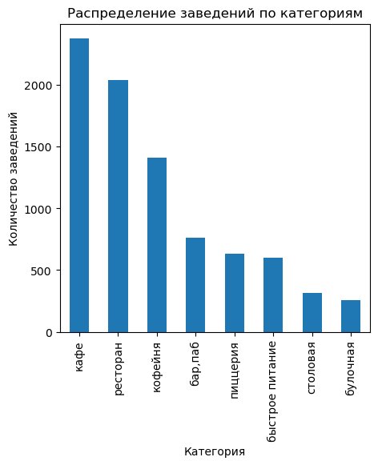
    


ТОП-3 категорий по количеству заведений в Москве:
1. Кафе - 2377 заведения (28.3%)
2. Ресторан - 2041 заведение (24.3%)
3. Кофейня - 1413 заведений (16.8%)
Меньше всего столовых (3.7%) и булочных (3%)

---

### Задача 2

Посмотрим какие административные районы Москвы присутствуют в данных и исследуем распределение количества заведений по административным районам Москвы, а также отдельно распределение заведений каждой категории в Центральном административном округе Москвы.


```python
# Выведем количество заведений по административным районам Москвы
df['district'].value_counts()
```


    district
    Центральный административный округ         2242
    Северный административный округ             899
    Южный административный округ                892
    Северо-Восточный административный округ     890
    Западный административный округ             850
    Восточный административный округ            798
    Юго-Восточный административный округ        714
    Юго-Западный административный округ         709
    Северо-Западный административный округ      409
    Name: count, dtype: int64


```python
# Выведем процентное соотношение количества заведений по административным районам Москвы
df['district'].value_counts()/df.shape[0]*100
```


    district
    Центральный административный округ         26.680947
    Северный административный округ            10.698560
    Южный административный округ               10.615256
    Северо-Восточный административный округ    10.591455
    Западный административный округ            10.115435
    Восточный административный округ            9.496608
    Юго-Восточный административный округ        8.496965
    Юго-Западный административный округ         8.437463
    Северо-Западный административный округ      4.867309
    Name: count, dtype: float64


```python
# Визуализируем на круговой диаграмме распределение количества заведений по административным округам
df['district'].value_counts().plot(
    kind='pie',
    autopct='%1.1f%%',
    figsize=(7,7),
    ylabel='',
    title='Распределение количества заведений по округам',
    wedgeprops={'linewidth': 0.8, 'edgecolor': 'white'}
);
```


    
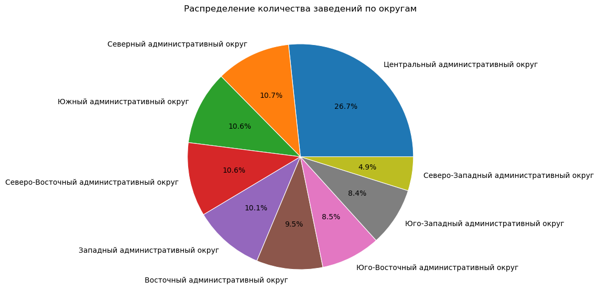
    


```python
# Выводим количество заведений по категориям в разрезе ЦАО
df.loc[df['district'] == 'Центральный административный округ', 'category'].value_counts()
```


    category
    ресторан           670
    кафе               464
    кофейня            428
    бар,паб            364
    пиццерия           113
    быстрое питание     87
    столовая            66
    булочная            50
    Name: count, dtype: int64


```python
# Выводим процентное соотношение категорий в ЦАО
df.loc[df['district'] == 'Центральный административный округ', 'category'].value_counts()/df.loc[df['district'] == 'Центральный административный округ', 'category'].shape[0]*100
```


    category
    ресторан           29.884032
    кафе               20.695807
    кофейня            19.090098
    бар,паб            16.235504
    пиццерия            5.040143
    быстрое питание     3.880464
    столовая            2.943800
    булочная            2.230152
    Name: count, dtype: float64


```python
# Визуализируем на горизонтальной диаграмме распределение категорий заведений в ЦАО
df.loc[df['district'] == 'Центральный административный округ', 'category'].value_counts().plot(
    kind='barh',
    figsize=(12,3),
    xlabel='Количество заведений',
    ylabel='Категория заведения',
    title='Распределение категорий заведений в ЦАО'
);
```


    
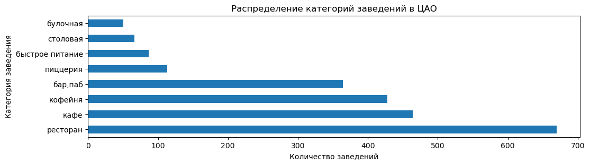
    


В данных присуствуют 9 из 12 округов Москвы. Большинство заведений (26.7%) сосредоточего в ЦАО - 2242. Меньше всего в СЗАО - 409 (4.8%). Остальные округа имеют примерно одинаковое распределение заведений, с разбросом в 2%.

В ЦАО в основном представлены: рестораны 670 (29.8%), кафе 464 (20.7%), кофейни 428 (19.1%), бары 364 (16.2%). Остальные категории представлены ниже 5%.

---

### Задача 3

Изучим соотношение сетевых и несетевых заведений в целом по всем данным и в разрезе категорий заведения. Опредеим каких заведений больше — сетевых или несетевых, какие категории заведений чаще являются сетевыми.


```python
# Выведем общее количество сетевых и не сетевых заведений
# 0 - заведение не сетевое, 1 - заведение сетевое
df.groupby('chain')['id'].count()
```


    chain
    0    5198
    1    3205
    Name: id, dtype: int64


```python
# Выведем соотношение сетевых и не сетевых заведений в разрезе категорий заведений, отсротируем по возрастанию
task_chain=pd.pivot_table(
    df,
    index='category',
    columns='chain',
    values='name',
    aggfunc='count'
)
task_chain['ratio']=round(task_chain[0]/task_chain[1],2)
task_chain.sort_values(by=[0,1], ascending=False)
```


<div>
<table border="1" class="dataframe">
  <thead>
    <tr style="text-align: right;">
      <th>chain</th>
      <th>0</th>
      <th>1</th>
      <th>ratio</th>
    </tr>
    <tr>
      <th>category</th>
      <th></th>
      <th></th>
      <th></th>
    </tr>
  </thead>
  <tbody>
    <tr>
      <th>кафе</th>
      <td>1598</td>
      <td>779</td>
      <td>2.05</td>
    </tr>
    <tr>
      <th>ресторан</th>
      <td>1311</td>
      <td>730</td>
      <td>1.80</td>
    </tr>
    <tr>
      <th>кофейня</th>
      <td>693</td>
      <td>720</td>
      <td>0.96</td>
    </tr>
    <tr>
      <th>бар,паб</th>
      <td>596</td>
      <td>169</td>
      <td>3.53</td>
    </tr>
    <tr>
      <th>быстрое питание</th>
      <td>371</td>
      <td>232</td>
      <td>1.60</td>
    </tr>
    <tr>
      <th>пиццерия</th>
      <td>303</td>
      <td>330</td>
      <td>0.92</td>
    </tr>
    <tr>
      <th>столовая</th>
      <td>227</td>
      <td>88</td>
      <td>2.58</td>
    </tr>
    <tr>
      <th>булочная</th>
      <td>99</td>
      <td>157</td>
      <td>0.63</td>
    </tr>
  </tbody>
</table>
</div>


```python
# Визуализируем на диаграмме соотношение сетевых и не сетевых заведений по категориям
task_chain.iloc[:, [0, 1]].sort_values(by=[0,1], ascending=False).plot(
    kind='bar',
    figsize=(7,5),
    xlabel='Категория заведения',
    ylabel='Количество заведений',
    title='Соотношение сетевых и не сетевых заведений',
    grid=True
);
```


    
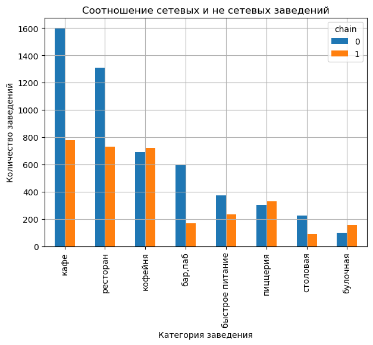
    


```python
# Выведем соотношение кагероий заведений только среди сетевых, отсортируем по возрастанию
task_chain_1=pd.pivot_table(
    df[df['chain']==1],
    index='category',
    columns='chain',
    values='name',
    aggfunc='count'
)
task_chain_1['ratio']=round(task_chain_1[1]/task_chain_1[1].sum()*100,2)
task_chain_1.sort_values(by=[1], ascending=False)
```


<div>
<table border="1" class="dataframe">
  <thead>
    <tr style="text-align: right;">
      <th>chain</th>
      <th>1</th>
      <th>ratio</th>
    </tr>
    <tr>
      <th>category</th>
      <th></th>
      <th></th>
    </tr>
  </thead>
  <tbody>
    <tr>
      <th>кафе</th>
      <td>779</td>
      <td>24.31</td>
    </tr>
    <tr>
      <th>ресторан</th>
      <td>730</td>
      <td>22.78</td>
    </tr>
    <tr>
      <th>кофейня</th>
      <td>720</td>
      <td>22.46</td>
    </tr>
    <tr>
      <th>пиццерия</th>
      <td>330</td>
      <td>10.30</td>
    </tr>
    <tr>
      <th>быстрое питание</th>
      <td>232</td>
      <td>7.24</td>
    </tr>
    <tr>
      <th>бар,паб</th>
      <td>169</td>
      <td>5.27</td>
    </tr>
    <tr>
      <th>булочная</th>
      <td>157</td>
      <td>4.90</td>
    </tr>
    <tr>
      <th>столовая</th>
      <td>88</td>
      <td>2.75</td>
    </tr>
  </tbody>
</table>
</div>


```python
# Визуализируем соотношение категорий сетевых заведений на круговой диаграмме
task_chain_1.sort_values(by=[1], ascending=False)[1].plot(
    autopct='%1.1f%%',
    kind='pie',
    figsize=(6,7),
    ylabel='',
    title='Распределение количества категорий сетевых заведений',
    wedgeprops={'linewidth': 0.8, 'edgecolor': 'white'}  
);
```


    
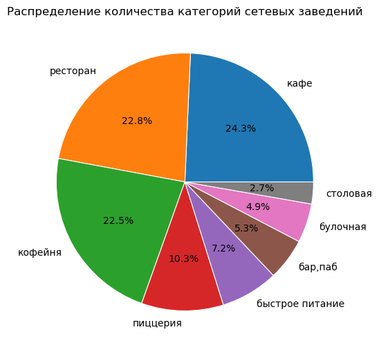
    


Всего по количеству заведений, не сетевых на 61.7% больше (5198), чем сетевых. 
- Самый большой разрыв в категории "бар, паб" - не сетевых заведений в 3.5 раза больше, чем сетевых. На втором месте категория "столовые" - 2.6 раза. На третьем кафе - 2.1 раза
- В категориях "кофейня" и "пиццерия" количество сетевых и не сетевых заведений почти одинаковое
- В категориях "булочная" сетевых заведений в 1.6 раза больше, чем не сетевых
- Среди всех сетевых заведений ТОП-3 категорий: "кафе" 24.3%, "ресторан" 22.8%, кофейня 22.5%
- Самые не сетевые заведения - это столовые, менее 3%.

---

### Задача 4

Исследуем количество посадочных мест в заведениях. Проверим наличие аномальных значений или выбросов. Выведем для каждой категории заведений наиболее типичное для него количество посадочных мест.


```python
# Визуализируем ящик с усами по данным из датасета df столбца seats (кол-во посадочных мест в заведениях)
plt.figure(figsize=(15, 3))
df.boxplot(column='seats', vert=False)
plt.xlabel('Количество посадочных мест')
plt.title('Распределение посадочных мест в заведениях');
```


    
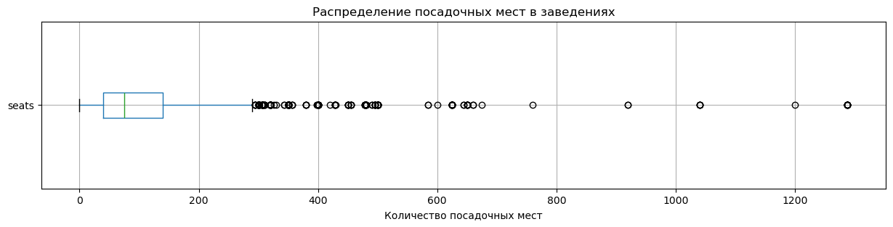
    


Распределение данных не равномерное, характеризуется большими выбросами в положительной части, они мешают анализу основных данных, поэтому выведем отдельно boxplot без выбросов:


```python
# Визуализируем ящик с усами без выбросов
plt.figure(figsize=(15, 3))
df.boxplot(column='seats', vert=False, showfliers=False)
plt.xlabel('Количество посадочных мест')
plt.title('Распределение посадочных мест в заведениях (без выбросов)');
```


    
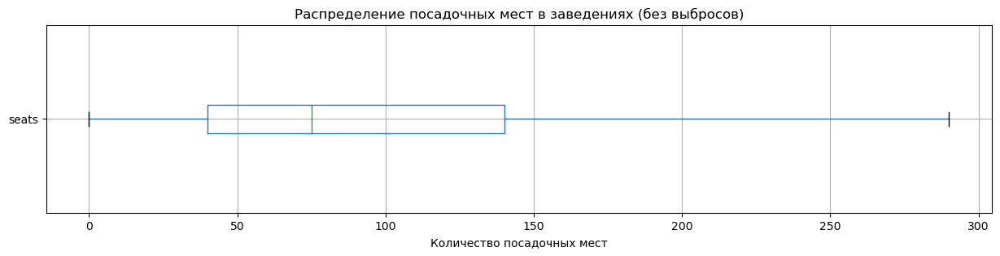
    


```python
# Выводим гистограмму 
df.loc[df['seats']<300,'seats'].plot(
                kind='hist', 
                bins=50, 
                alpha=0.75,
                edgecolor='black',
                xlabel='Количество посадочных мест',
                ylabel='Частота',
                title='Распределение количества посадочных мест'
)
plt.grid()
```


    
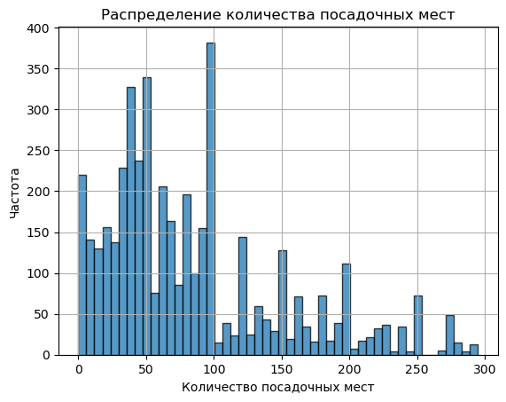
    


```python
# Выводим ТОП-5 количества посадочных мест в заведениях
df['seats'].value_counts().sort_values(ascending=False).head()
```


    seats
    40     253
    100    213
    60     175
    50     168
    80     160
    Name: count, dtype: Int64


```python
#  Визуализируем на диаграмме полученные значения
df.groupby('category')['seats'].median().sort_values(ascending=False).plot(
    kind='bar',
    figsize=(5,6),
    xlabel='Категория заведений',
    ylabel='Медианное значение количества посадочных мест',
    title='Наиболее типичные для категорий количества посадочных мест'
);
```


    
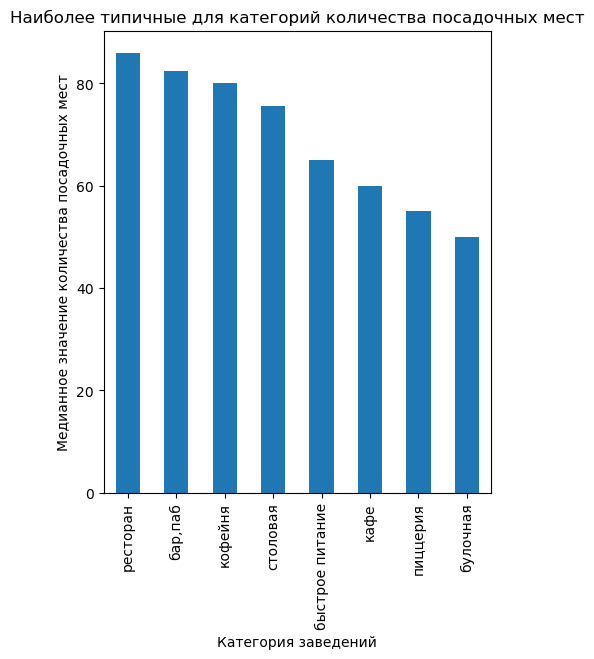
    


- Данные в столбце `seats` имеют большие выбросы. С высокой долей вероятности часть из выбросов являются аномальными, потому что более тысячи посадочных мест это уже больше похоже на концертный зал, а не на кофейню или бар.
- Распределение данных по количеству мест не равномерное, смещено в положительную сторону.
- Минимальное значение посадочных мест в датасете равно 0 - это заведения, работающие "на вынос" (136 заведений). Медианное значение количества посадочных мест по всем заведениям - 75.
- ТОП-3 по количеству посадочных мест в Москве - 40 мест (253 заведения), 100 мест (213 заведений), 60 мест (175 заведений)
- В среднем, больше всего посадочных мест в категории "ресторан" - 86 мест. Меньше всего в категории "булочная" - 50 мест.

---

### Задача 5

Исследуем рейтинг заведений. Визуализируем распределение средних рейтингов по категориям заведений. Проведем анализ сильно ли различаются усреднённые рейтинги для разных типов общепита.


```python
df['rating'].describe()
```


    count    8403.000000
    mean        4.229894
    std         0.470426
    min         1.000000
    25%         4.100000
    50%         4.300000
    75%         4.400000
    max         5.000000
    Name: rating, dtype: float64


```python
# Визуализируем ящик с усами по данным из датасета df столбца rating
plt.figure(figsize=(15, 3))
df.boxplot(column='rating', vert=False)
plt.xlabel('Рейтинг заведения')
plt.title('Распределение рейтингов заведений');
```


    
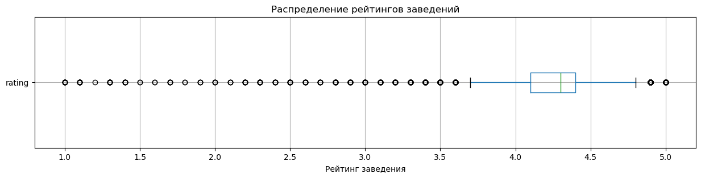
    


Распределение данных не равномерное, характеризуется большими выбросами в отрицательной части


```python
# Визуализируем ящик с усами по данным из датасета df столбца rating без выбросов
plt.figure(figsize=(15, 3))
df.boxplot(column='rating', vert=False, showfliers=False)
plt.xlabel('Рейтинг заведения')
plt.title('Распределение рейтингов заведений');
```


    
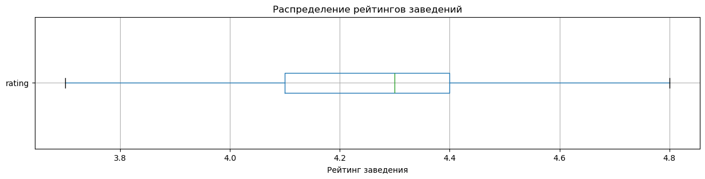
    


```python
# Выводим диаграмму 
df['rating'].plot(
                kind='hist', 
                bins=30, 
                alpha=0.75,
                edgecolor='black',
                xlabel='Рейтинг',
                ylabel='Частота',
                title='Распределение рейтинга заведений'
)
plt.grid()
```


    
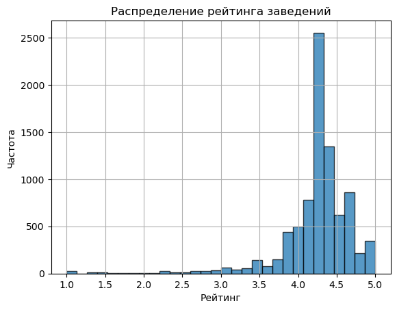
    


```python
# Проведем анализ рейтингов по категориям заведений
df.groupby('category')['rating'].mean().sort_values(ascending=False)
```


    category
    бар,паб            4.387712
    пиццерия           4.301264
    ресторан           4.290348
    кофейня            4.277282
    булочная           4.268359
    столовая           4.211429
    кафе               4.123896
    быстрое питание    4.050249
    Name: rating, dtype: float64


Средний рейтинг по всем заведениям - 4.3 и распределяется в основном от 4.1 до 4.4. У категорий "бар, паб" средний рейтинг немнго выше, но незначительно. Можно заключить, что от категории заведения рейтинг никак не зависит. 

---

### Задача 6

Изучим с какими данными показывают самую сильную корреляцию рейтинги заведений. Построим и визуализируйте матрицу корреляции рейтинга заведения с разными данными: его категория, положение (административный район Москвы), статус сетевого заведения, количество мест, ценовая категория и признак, является ли заведения круглосуточным. Выберим самую сильную связь и проверим её.


```python
# Вычисляем корреляционную матрицу с использованием phi_k
correlation_matrix = df[['rating','category', 'district', 'chain', 'seats', 'price', 'is_24_7']].phik_matrix()
correlation_matrix
```

    interval columns not set, guessing: ['rating', 'chain', 'seats']


<div>
<table border="1" class="dataframe">
  <thead>
    <tr style="text-align: right;">
      <th></th>
      <th>rating</th>
      <th>category</th>
      <th>district</th>
      <th>chain</th>
      <th>seats</th>
      <th>price</th>
      <th>is_24_7</th>
    </tr>
  </thead>
  <tbody>
    <tr>
      <th>rating</th>
      <td>1.000000</td>
      <td>0.189864</td>
      <td>0.200701</td>
      <td>0.108340</td>
      <td>0.000000</td>
      <td>0.220295</td>
      <td>0.150210</td>
    </tr>
    <tr>
      <th>category</th>
      <td>0.189864</td>
      <td>1.000000</td>
      <td>0.174474</td>
      <td>0.265532</td>
      <td>0.048265</td>
      <td>0.566933</td>
      <td>0.244785</td>
    </tr>
    <tr>
      <th>district</th>
      <td>0.200701</td>
      <td>0.174474</td>
      <td>1.000000</td>
      <td>0.064431</td>
      <td>0.352440</td>
      <td>0.202787</td>
      <td>0.076370</td>
    </tr>
    <tr>
      <th>chain</th>
      <td>0.108340</td>
      <td>0.265532</td>
      <td>0.064431</td>
      <td>1.000000</td>
      <td>0.057584</td>
      <td>0.218211</td>
      <td>0.043274</td>
    </tr>
    <tr>
      <th>seats</th>
      <td>0.000000</td>
      <td>0.048265</td>
      <td>0.352440</td>
      <td>0.057584</td>
      <td>1.000000</td>
      <td>0.088146</td>
      <td>0.043193</td>
    </tr>
    <tr>
      <th>price</th>
      <td>0.220295</td>
      <td>0.566933</td>
      <td>0.202787</td>
      <td>0.218211</td>
      <td>0.088146</td>
      <td>1.000000</td>
      <td>0.084183</td>
    </tr>
    <tr>
      <th>is_24_7</th>
      <td>0.150210</td>
      <td>0.244785</td>
      <td>0.076370</td>
      <td>0.043274</td>
      <td>0.043193</td>
      <td>0.084183</td>
      <td>1.000000</td>
    </tr>
  </tbody>
</table>
</div>


```python
# Строим хитмап корреляции `rating` с другими параметрами
data_heatmap = correlation_matrix.loc[correlation_matrix.index != 'rating'][['rating']].sort_values(by='rating', ascending=False)
# Строим тепловую карту
plt.figure(figsize=(2, 6))
sns.heatmap(data_heatmap,
            annot=True, # Отображаем численные значения в ячейках карты
            fmt='.2f', # Форматируем значения корреляции: два знака после точки
            cmap='coolwarm', # Устанавливаем цветовую гамму от красного (макс. значение) к синему
            linewidths=0.5 # Форматируем линию между ячейками карты
           )

# Добавляем заголовок и подпись по оси Х
plt.title('Корреляция рейтинга заведения от других показателей')
plt.xlabel('')

# Выводим график
plt.show()
```


    
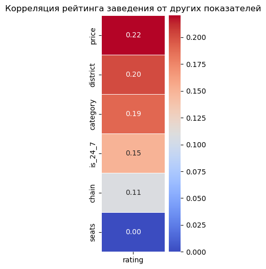
    


```python
# Проверяем корреляцию между `price` и `rating`
df.groupby('price')['rating'].mean()
```


    price
    высокие          4.436611
    выше среднего    4.386348
    низкие           4.173077
    средние          4.297874
    Name: rating, dtype: float64


```python
# Выводим scatter-график зависимости средней цены и рейтинга
sx=df.plot(
    kind='scatter',
    x='middle_avg_bill',
    y='rating',
    s=10,
    alpha=0.5
)
sx.set_xlim(0,8000)
```


    (0.0, 8000.0)


    
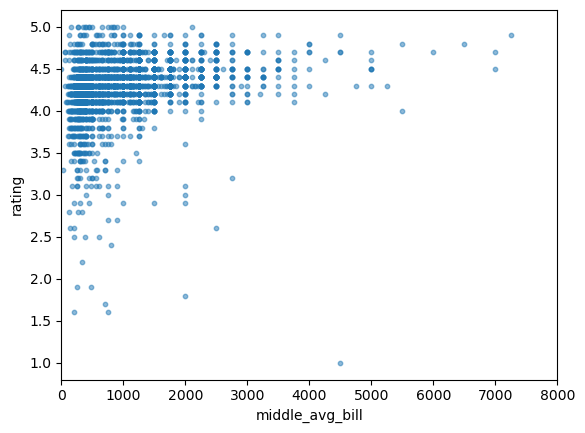
    


- `rating` сильнее всего коррелирует с `price`, но эта зависимость тоже не достаточно сильная, чтобы строить на этом какую-то гипотезу. Самый высокий средний рейтинг у заведений с категорией цен "выше среднего" - 4.39, самый низкий у "низкие" - 4.17
- Анализ показал, что рейтинг заведений не имеет сильных корреляций от представленных в датасете данных. 

---

### Задача 7

Сгруппируем данные по названиям заведений и найдем топ-15 популярных сетей в Москве. Для них посчитаем значения среднего рейтинга. Под популярностью понимается количество заведений этой сети в регионе. Определим к какой категории заведений они относятся.


```python
# Группируем по name и считаем кол-во повторений
task_7 = df[df['chain'] == 1].groupby('name').agg(
    count=('id', 'count'),
    avg_rating=('rating', 'mean'),
    category=('category', 'first')
).sort_values('count', ascending=False).head(15)
task_7
```


<div>
<table border="1" class="dataframe">
  <thead>
    <tr style="text-align: right;">
      <th></th>
      <th>count</th>
      <th>avg_rating</th>
      <th>category</th>
    </tr>
    <tr>
      <th>name</th>
      <th></th>
      <th></th>
      <th></th>
    </tr>
  </thead>
  <tbody>
    <tr>
      <th>шоколадница</th>
      <td>120</td>
      <td>4.177500</td>
      <td>кофейня</td>
    </tr>
    <tr>
      <th>домино'с пицца</th>
      <td>76</td>
      <td>4.169737</td>
      <td>пиццерия</td>
    </tr>
    <tr>
      <th>додо пицца</th>
      <td>74</td>
      <td>4.286486</td>
      <td>пиццерия</td>
    </tr>
    <tr>
      <th>one price coffee</th>
      <td>71</td>
      <td>4.064789</td>
      <td>кофейня</td>
    </tr>
    <tr>
      <th>яндекс лавка</th>
      <td>69</td>
      <td>3.872464</td>
      <td>ресторан</td>
    </tr>
    <tr>
      <th>cofix</th>
      <td>65</td>
      <td>4.075385</td>
      <td>кофейня</td>
    </tr>
    <tr>
      <th>prime</th>
      <td>50</td>
      <td>4.116000</td>
      <td>ресторан</td>
    </tr>
    <tr>
      <th>хинкальная</th>
      <td>44</td>
      <td>4.322727</td>
      <td>быстрое питание</td>
    </tr>
    <tr>
      <th>кофепорт</th>
      <td>42</td>
      <td>4.147619</td>
      <td>кофейня</td>
    </tr>
    <tr>
      <th>кулинарная лавка братьев караваевых</th>
      <td>39</td>
      <td>4.394872</td>
      <td>кафе</td>
    </tr>
    <tr>
      <th>теремок</th>
      <td>38</td>
      <td>4.123684</td>
      <td>ресторан</td>
    </tr>
    <tr>
      <th>чайхана</th>
      <td>37</td>
      <td>3.924324</td>
      <td>кафе</td>
    </tr>
    <tr>
      <th>cofefest</th>
      <td>32</td>
      <td>3.984375</td>
      <td>кофейня</td>
    </tr>
    <tr>
      <th>буханка</th>
      <td>32</td>
      <td>4.396875</td>
      <td>булочная</td>
    </tr>
    <tr>
      <th>му-му</th>
      <td>27</td>
      <td>4.229630</td>
      <td>кафе</td>
    </tr>
  </tbody>
</table>
</div>


```python
# Отобразим на диаграмме полученные значения
task_7['count'].plot(
    kind='barh',
    grid=True,
    figsize=(12,8),
    xlabel='Количество заведений',
    ylabel='',
    title='ТОП-15 сетевых заведений в Москве'    
);
```


    
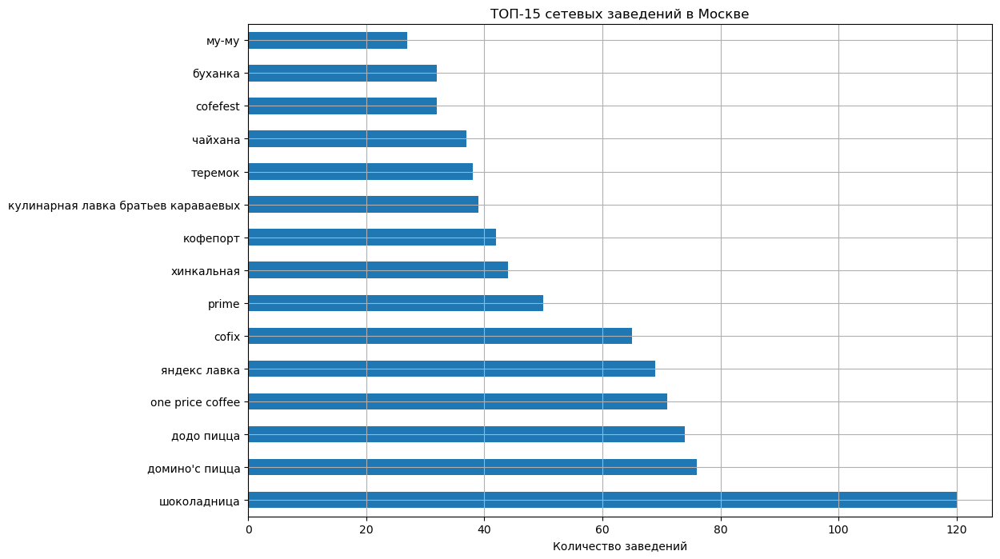
    


```python
task_7['category'].value_counts().plot(
    kind='bar',
    xlabel='',
    ylabel='Количество заведений',
    title='Срез по категориям'
);
```


    
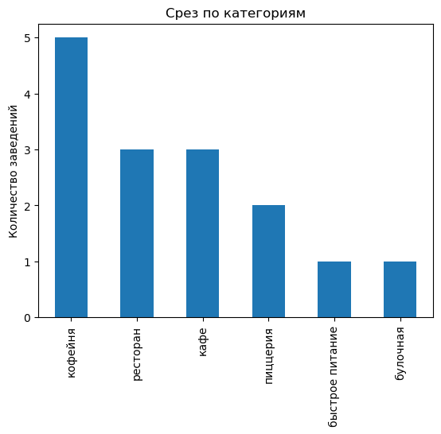
    


```python
# Выводим сортировку по рейтингу заведений ТОП-15
task_7.sort_values('avg_rating', ascending=False)
```


<div>
<table border="1" class="dataframe">
  <thead>
    <tr style="text-align: right;">
      <th></th>
      <th>count</th>
      <th>avg_rating</th>
      <th>category</th>
    </tr>
    <tr>
      <th>name</th>
      <th></th>
      <th></th>
      <th></th>
    </tr>
  </thead>
  <tbody>
    <tr>
      <th>буханка</th>
      <td>32</td>
      <td>4.396875</td>
      <td>булочная</td>
    </tr>
    <tr>
      <th>кулинарная лавка братьев караваевых</th>
      <td>39</td>
      <td>4.394872</td>
      <td>кафе</td>
    </tr>
    <tr>
      <th>хинкальная</th>
      <td>44</td>
      <td>4.322727</td>
      <td>быстрое питание</td>
    </tr>
    <tr>
      <th>додо пицца</th>
      <td>74</td>
      <td>4.286486</td>
      <td>пиццерия</td>
    </tr>
    <tr>
      <th>му-му</th>
      <td>27</td>
      <td>4.229630</td>
      <td>кафе</td>
    </tr>
    <tr>
      <th>шоколадница</th>
      <td>120</td>
      <td>4.177500</td>
      <td>кофейня</td>
    </tr>
    <tr>
      <th>домино'с пицца</th>
      <td>76</td>
      <td>4.169737</td>
      <td>пиццерия</td>
    </tr>
    <tr>
      <th>кофепорт</th>
      <td>42</td>
      <td>4.147619</td>
      <td>кофейня</td>
    </tr>
    <tr>
      <th>теремок</th>
      <td>38</td>
      <td>4.123684</td>
      <td>ресторан</td>
    </tr>
    <tr>
      <th>prime</th>
      <td>50</td>
      <td>4.116000</td>
      <td>ресторан</td>
    </tr>
    <tr>
      <th>cofix</th>
      <td>65</td>
      <td>4.075385</td>
      <td>кофейня</td>
    </tr>
    <tr>
      <th>one price coffee</th>
      <td>71</td>
      <td>4.064789</td>
      <td>кофейня</td>
    </tr>
    <tr>
      <th>cofefest</th>
      <td>32</td>
      <td>3.984375</td>
      <td>кофейня</td>
    </tr>
    <tr>
      <th>чайхана</th>
      <td>37</td>
      <td>3.924324</td>
      <td>кафе</td>
    </tr>
    <tr>
      <th>яндекс лавка</th>
      <td>69</td>
      <td>3.872464</td>
      <td>ресторан</td>
    </tr>
  </tbody>
</table>
</div>


- ТОП-3 сетевых заведений из представленных данных: Шоколадница (120 заведений), Домино'с пицца (76), Додо пицца (74). Шоколадница идет с большим отрывом в 44 заведения.
- Самая попопулярная категория из ТОП-15 - кофейня, в ней представлено 5 заведений (шоколадница, кофепорт, cofix, one price coffee, cofefest). Самые не популярные категории - булочная и быстрое питание (по 1 заведению)
- Самый высокий средний рейтинг по заведениям из списка ТОП-15 имеет Буханка и Кулинарная лавка братьев караваевых - ср. рейтинг 4.4. Самый низкий - Яндекс лавка (3.8).

---

### Задача 8

Изучим вариации среднего чека заведения (столбец `middle_avg_bill`) в зависимости от района Москвы. Проанализируем цены в Центральном административном округе и других. Проанализируем как удалённость от центра влияет на цены в заведениях.


```python
# Выведем средний чек для каждого района Москвы
task_8=df.groupby('district')['middle_avg_bill'].mean().round(0).sort_values(ascending=False)
task_8
```


    district
    Центральный административный округ         1191.0
    Западный административный округ            1053.0
    Северный административный округ             928.0
    Южный административный округ                834.0
    Северо-Западный административный округ      822.0
    Восточный административный округ            821.0
    Юго-Западный административный округ         793.0
    Северо-Восточный административный округ     717.0
    Юго-Восточный административный округ        654.0
    Name: middle_avg_bill, dtype: float64


```python
# Визуализируем зависимость на диаграмме
task_8.plot(
    kind='barh',
    xlabel='Средняя цена',
    ylabel='',
    title='Соотношение среднего чека и района Москвы',
    grid=True
);
```


    
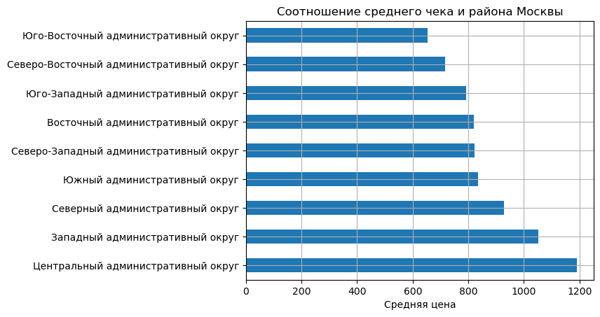
    


```python
# Проведем анализ среднего чека в ЦАО
task_8_centr=df[df['district']=='Центральный административный округ'].groupby('category')['middle_avg_bill'].mean().sort_values(ascending=False)
task_8_centr
```


    category
    ресторан           1561.059113
    бар,паб            1479.739884
    булочная           1237.916667
    пиццерия           1104.839506
    кофейня             794.764706
    кафе                765.176190
    быстрое питание     532.081633
    столовая            319.886364
    Name: middle_avg_bill, dtype: float64


```python
# Представим данные на диаграмме
task_8_centr.plot(
    kind='bar',
    xlabel='',
    ylabel='Средний чек',
    title='Распределение среднего чека по категориям в ЦАО'
);
```


    
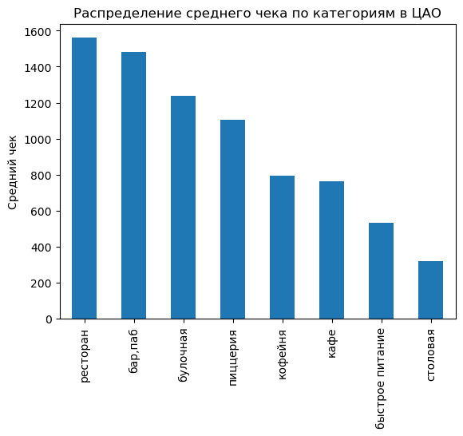
    


```python
# Выведем категории и округа с максимальными средними чеками 
task_8_all=df.groupby(['category', 'district'])['middle_avg_bill'].mean().round(0).reset_index()
task_8_max=task_8_all.loc[task_8_all.groupby('category')['middle_avg_bill'].idxmax()]
task_8_max=task_8_max.reset_index(drop=True)
task_8_max
```


<div>
<table border="1" class="dataframe">
  <thead>
    <tr style="text-align: right;">
      <th></th>
      <th>category</th>
      <th>district</th>
      <th>middle_avg_bill</th>
    </tr>
  </thead>
  <tbody>
    <tr>
      <th>0</th>
      <td>бар,паб</td>
      <td>Северный административный округ</td>
      <td>1573.0</td>
    </tr>
    <tr>
      <th>1</th>
      <td>булочная</td>
      <td>Центральный административный округ</td>
      <td>1238.0</td>
    </tr>
    <tr>
      <th>2</th>
      <td>быстрое питание</td>
      <td>Восточный административный округ</td>
      <td>832.0</td>
    </tr>
    <tr>
      <th>3</th>
      <td>кафе</td>
      <td>Западный административный округ</td>
      <td>827.0</td>
    </tr>
    <tr>
      <th>4</th>
      <td>кофейня</td>
      <td>Центральный административный округ</td>
      <td>795.0</td>
    </tr>
    <tr>
      <th>5</th>
      <td>пиццерия</td>
      <td>Центральный административный округ</td>
      <td>1105.0</td>
    </tr>
    <tr>
      <th>6</th>
      <td>ресторан</td>
      <td>Центральный административный округ</td>
      <td>1561.0</td>
    </tr>
    <tr>
      <th>7</th>
      <td>столовая</td>
      <td>Западный административный округ</td>
      <td>565.0</td>
    </tr>
  </tbody>
</table>
</div>


```python
# Выведем категории и округа с минимальными средними чеками 
task_8_min=task_8_all.loc[task_8_all.groupby('category')['middle_avg_bill'].idxmin()]
task_8_min=task_8_min.reset_index(drop=True)
task_8_min
```


<div>
<table border="1" class="dataframe">
  <thead>
    <tr style="text-align: right;">
      <th></th>
      <th>category</th>
      <th>district</th>
      <th>middle_avg_bill</th>
    </tr>
  </thead>
  <tbody>
    <tr>
      <th>0</th>
      <td>бар,паб</td>
      <td>Северо-Восточный административный округ</td>
      <td>987.0</td>
    </tr>
    <tr>
      <th>1</th>
      <td>булочная</td>
      <td>Северо-Западный административный округ</td>
      <td>200.0</td>
    </tr>
    <tr>
      <th>2</th>
      <td>быстрое питание</td>
      <td>Северо-Западный административный округ</td>
      <td>295.0</td>
    </tr>
    <tr>
      <th>3</th>
      <td>кафе</td>
      <td>Юго-Восточный административный округ</td>
      <td>589.0</td>
    </tr>
    <tr>
      <th>4</th>
      <td>кофейня</td>
      <td>Юго-Восточный административный округ</td>
      <td>263.0</td>
    </tr>
    <tr>
      <th>5</th>
      <td>пиццерия</td>
      <td>Юго-Восточный административный округ</td>
      <td>562.0</td>
    </tr>
    <tr>
      <th>6</th>
      <td>ресторан</td>
      <td>Юго-Восточный административный округ</td>
      <td>932.0</td>
    </tr>
    <tr>
      <th>7</th>
      <td>столовая</td>
      <td>Юго-Восточный административный округ</td>
      <td>289.0</td>
    </tr>
  </tbody>
</table>
</div>


- ТОП-3 самых высоких средних чека по всем заведениям в Москве: ЦАО - 1191, ЗАО - 1053, САО - 928.
- Самый низкий средний чек по всем заведениям в ЮВАО - 654.
- В ЦАО самый высокий средний чек в категории "ресторан" - 1561, самый низкий в категории "столовая" - 319.
- В ЦАО находятся заведения с самым высоким средним чеком в категориях "ресторан", "пиццерия", "кофейня", "булочная"
- В ЗАО находятся заведения с самым высоким средним чеком в категориях "кафе" и "столовая"
- Самые высокие средие чеки из категории "бар, паб" расположились в САО
- Самые высокие средие чеки из категории "быстрое питание" расположились в САО

---

### Промежуточный вывод

- В ходе исследования были определены самые популярные категории заведений в Москве - "кафе" (28.3%) и "ресторан" (24.3%)
- Среди административных округов по количеству заведений лидирует ЦАО (26.7%)
- Не сетевых заведений в Москве на 61.7% больше, чем сетевых. Самая популярная категория сетевых заведений - "кафе" (24.3%)
- Больше всего посадочных мест в категории «ресторан» - 86 мест, меньше всего в «булочная» - 50
- Рейтинги заведений не имеет сильных корреляций от представленных в датасете данных
- Самое популярное сетевое заведение в москве - Шоколадница (120 заведений), а самый высокий рейтинг из сетевых заведений у Буханки и Кулинарной лавки братьев караванных - 4.4.
- Самый высокий средний чек в заведениях "ресторан" в Центральном административном округе - 1561.

## Итоговый вывод и рекомендации

В ходе исследования были проанализированы 8406 заведений общественного питания по 9 районам города Москвы. Данные включали названия заведений, часы работы, рейтинг и средний чек. Все заведения были разбиты на категории и округа. Акцент исследования был сделан на категориях заведений, их локациях и средних ценах.

В Москве по количеству заведений лидируют категории "кафе" (28.3%) и "рестораны" (24.3%).

Большинство заведений расположено в ЦАО (26.7%), остальные 8 районов распределены почти равномерно. За исключением СЗАО, в котором расположены всего 4.8% заведений.
В ЦАО в основном представлены рестораны (29.8%), кафе (20.7%) и кофейни (19.1%).

Не сетевых заведений на 61.7% больше. Самый большой разрыв в категории «бар, паб» - не сетевых заведений здесь в 3.5 раза больше. Если же рассматривать категории «кофейня» и «пиццерия», то здесь количество сетевых и не сетевых заведений одинаковое. 
ТОП-3 категорий сетевых заведений в Москве: «кафе» (24.3%), «ресторан» (22.8%) и «кофейня» (22.5%).

Медианное значение посадочных мест во всех заведениях - 75 мест. Больше всего посадочных мест в категории «ресторан» - 86 мест, меньше всего в «булочная» - 50. Часть заведений (136) работают на вынос и не имеют посадочных мест. 

Все заведения имеют примерно одинаковый разброс среднего рейтинга от 4.1 до 4.4 и он не зависит от района, категории, режима работы или цен.

ТОП-3 сетевых заведений по количеству открытых точек в Москве - Шоколадница (120 заведений), Домино'с пицца (76), Додо пицца (74).
Самый высокий рейтинг из сетевых заведений у Буханки и Кулинарной лавки братьев караванных - 4.4.

ТОП-3 района самых высоких средних чеков по всем заведениям в Москве: ЦАО - 1191, ЗАО - 1053, САО - 928.
В ЦАО находятся заведения с самым высоким средним чеком в категориях "ресторан", "пиццерия", "кофейня" и "булочная». Средний чек в категории "ресторан" - 1561.
В ЮВАО встречаются самые низкие средние чеки в категориях «кофейня», «пиццерия», «ресторан», «столовая».

В качестве рекоммендаций стоит обратить внимание на административные округа с самым высоким средним чеком: Центральный, Западный и Северный. "Ресторан", "пиццерия" и "кофейня" имеют больший средний чек, чем другие категории, но при этом в категориях "пиццерия" и "кофейня" представлены самые крупные сетевые заведения, которые составят большую конкуренцию. В категории "ресторан" в среднем требуется больше всего пасадочных мест и это стоит учитывать при расчете инвестиций. Количество сетевых заведений в категории "ресторан" на втором месте после "кафе", но при этом ни одна из сетей по количеству точек не входит в ТОП-5. Возможно, это стоит рассмотреть как точку дальнейшего роста.


```python

```
